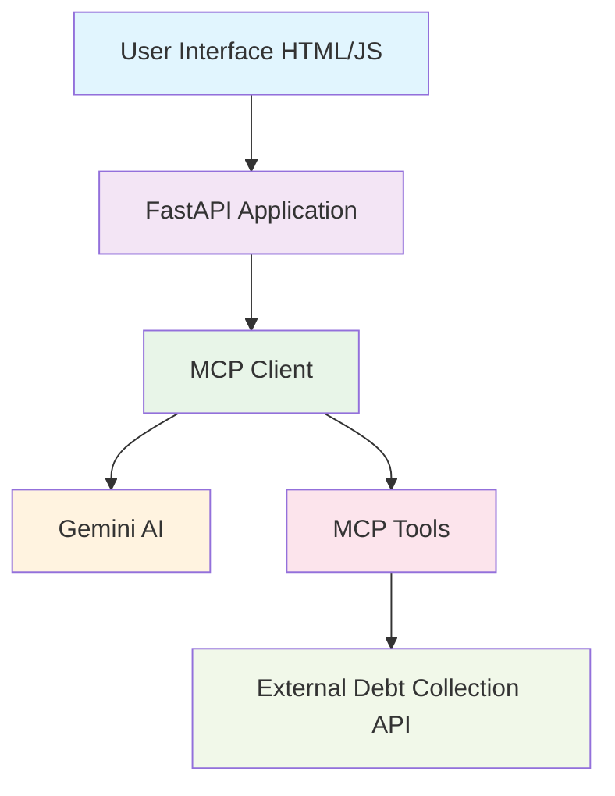

# Debt Collection MCP Server

[](https://python.org)
[](https://fastapi.tiangolo.com)
[](LICENSE)
[](https://github.com/yourusername/debt-collection-mcp/issues)
[](https://github.com/yourusername/debt-collection-mcp/stargazers)

A complete **Model Context Protocol (MCP)** implementation for debt collection systems with Gemini AI integration. This project provides a web-based interface for querying debt collection databases using natural language processing.

## 🚀 Features

- ✅ **Complete MCP Server Implementation** - Full Model Context Protocol support
- ✅ **Gemini AI Integration** - Natural language query processing
- ✅ **FastAPI Web Application** - Modern, fast web framework
- ✅ **Interactive Chat Interface** - User-friendly web UI
- ✅ **Tool-based API Integration** - Modular tool system
- ✅ **Real-time Query Processing** - Live data retrieval
- ✅ **Comprehensive Error Handling** - Robust error management
- ✅ **Production Ready** - Docker support and deployment guides

## 📋 Table of Contents

- [Architecture Overview](#architecture-overview)
- [Installation](#installation)
- [Configuration](#configuration)
- [Usage](#usage)
- [API Documentation](#api-documentation)
- [Development](#development)
- [Contributing](#contributing)
- [Security](#security)
- [License](#license)

## 🏗️ Architecture Overview



## 🛠️ Installation

### Prerequisites

- Python 3.9 or higher
- Gemini API Key ([Get one here](https://makersuite.google.com/app/apikey))
- Access to debt collection API endpoint

### Quick Start

1. **Clone the repository**
   ```bash
   git clone https://github.com/yourusername/debt-collection-mcp.git
   cd debt-collection-mcp
   ```

2. **Create virtual environment**
   ```bash
   python -m venv venv
   
   # On Windows
   venv\Scripts\activate
   
   # On macOS/Linux
   source venv/bin/activate
   ```

3. **Install dependencies**
   ```bash
   pip install -r requirements.txt
   ```

4. **Configure environment**
   ```bash
   cp .env.example .env
   # Edit .env with your configuration
   ```

5. **Run the application**
   ```bash
   python run_app.py
   ```

The application will be available at `http://localhost:8000`

## ⚙️ Configuration

Create a `.env` file in the project root:

```env
# Gemini API Configuration
GEMINI_API_KEY=your_gemini_api_key_here

# Server Configuration
FASTAPI_HOST=localhost
FASTAPI_PORT=8000
MCP_SERVER_HOST=localhost
MCP_SERVER_PORT=5000

# External API Configuration
DEBT_COLLECTION_API_URL=https://newip.collectco.com/emilyai/user-details-by-file-number
API_TIMEOUT=20
```

## 🚀 Usage

### Web Interface

1. Open your browser to `http://localhost:8000`
2. Type your query in the text area
3. Examples:
   - "Get client details for file number 123421"
   - "What is the email for file number 123421?"
   - "Show me information about file 123421"

### API Endpoints

#### POST `/api/query`
Process user query through MCP

**Request:**
```json
{
  "query": "Get details for file number 123421"
}
```

**Response:**
```json
{
  "success": true,
  "response": "Here are the details for client...",
  "tool_used": "get_user_details_by_file_number",
  "tool_result": {...}
}
```

#### GET `/api/health`
Check system health

**Response:**
```json
{
  "status": "healthy",
  "mcp_server": "connected",
  "gemini": "configured"
}
```

## 📁 Project Structure

```
debt-collection-mcp/
├── 📁 client_app/              # FastAPI web application
│   ├── __init__.py
│   ├── main.py                 # Main FastAPI app
│   ├── mcp_client.py           # MCP client with Gemini
│   └── 📁 templates/
│       └── index.html          # Web interface
├── 📁 mcp_server/              # MCP server implementation
│   ├── __init__.py
│   ├── server.py               # MCP server
│   ├── tools.py                # Tool definitions
│   └── config.py               # Configuration
├── 📁 static/                  # Static assets
│   ├── 📁 css/
│   │   └── style.css
│   └── 📁 js/
│       └── app.js
├── 📁 .github/                 # GitHub workflows and templates
│   ├── 📁 workflows/
│   └── 📁 ISSUE_TEMPLATE/
├── .env.example                # Environment configuration template
├── .gitignore                  # Git ignore rules
├── LICENSE                     # MIT License
├── README.md                   # This file
├── requirements.txt            # Python dependencies
└── run_app.py                  # Application entry point
```

## 🔧 Development

### Adding New Tools

1. Define tool in `mcp_server/tools.py`:
   ```python
   async def new_tool(self, param: str):
       """Tool description"""
       # Implementation
       pass
   ```

2. Add to tool definitions:
   ```python
   {
       "name": "new_tool",
       "description": "Tool description",
       "parameters": {...}
   }
   ```

3. Register in `mcp_server/server.py`

### Testing

```bash
# Test API endpoint
curl http://localhost:8000/api/health

# Test query
curl -X POST http://localhost:8000/api/query \
  -H "Content-Type: application/json" \
  -d '{"query": "Get details for file 123421"}'
```

### Running Tests

```bash
# Install test dependencies
pip install pytest pytest-asyncio httpx

# Run tests
pytest
```

## 🤝 Contributing

We welcome contributions! Please see our [Contributing Guide](CONTRIBUTING.md) for details.

### Development Setup

1. Fork the repository
2. Create a feature branch
3. Make your changes
4. Add tests for new functionality
5. Submit a pull request

## 🔒 Security

Please review our [Security Policy](SECURITY.md) for reporting security vulnerabilities.

## 🐛 Troubleshooting

### Common Issues

**1. Import Errors**
```bash
# Ensure you're in project root and virtual environment is activated
export PYTHONPATH="${PYTHONPATH}:$(pwd)"
```

**2. Gemini API Errors**
- Verify API key is correct in `.env`
- Check API quota limits

**3. Connection Errors**
- Verify external API endpoint is accessible
- Check network/firewall settings

## 📄 License

This project is licensed under the MIT License - see the [LICENSE](LICENSE) file for details.

## 🙏 Acknowledgments

- [FastAPI](https://fastapi.tiangolo.com/) for the web framework
- [Google Gemini](https://ai.google.dev/) for AI capabilities
- [Model Context Protocol](https://modelcontextprotocol.io/) for the protocol implementation

## 📞 Support

- 📧 Email: your-email@example.com
- 🐛 Issues: [GitHub Issues](https://github.com/yourusername/debt-collection-mcp/issues)
- 💬 Discussions: [GitHub Discussions](https://github.com/yourusername/debt-collection-mcp/discussions)

---

⭐ If you found this project helpful, please give it a star!